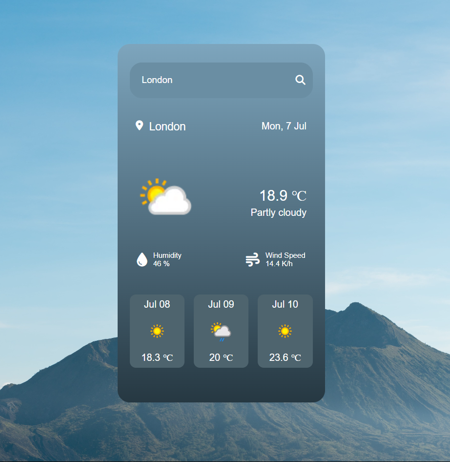

# 🌤️ Weather App

A responsive weather forecast app built with **HTML**, **CSS**, and **JavaScript**, using data from [WeatherAPI.com](https://www.weatherapi.com/).  
It allows users to search for any city and displays the current weather along with a 3-day forecast.

---

## 📸 Preview

---

## ⚙️ Features

- 🔍 Search for any city using the search bar
- 🌡️ Display current temperature (heat index)
- ☁️ Shows cloud status, humidity, and wind speed
- 📆 3-day forecast with icons and formatted dates
- ❌ Error handling for invalid cities
- 📱 Fully responsive for all screen sizes
- 🎨 Clean and modern UI using gradients and icon packs

---

## 🧰 Tech Stack

- HTML5
- CSS3 (Flexbox, Media Queries)
- JavaScript (ES6)
- [WeatherAPI.com](https://www.weatherapi.com/)

